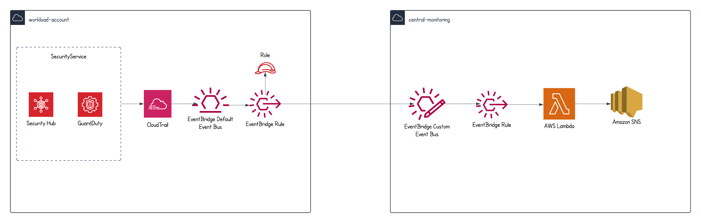

# AWS cross-account event bridge.
This sample demonstrates the cross account communication via event rule. 

## Prerequisite. 
1. You should have two AWS account to perform this demo.

## Workflow

## Deployment
1. Deploy central account stack.
2. Deploy workload account stack in different account.

